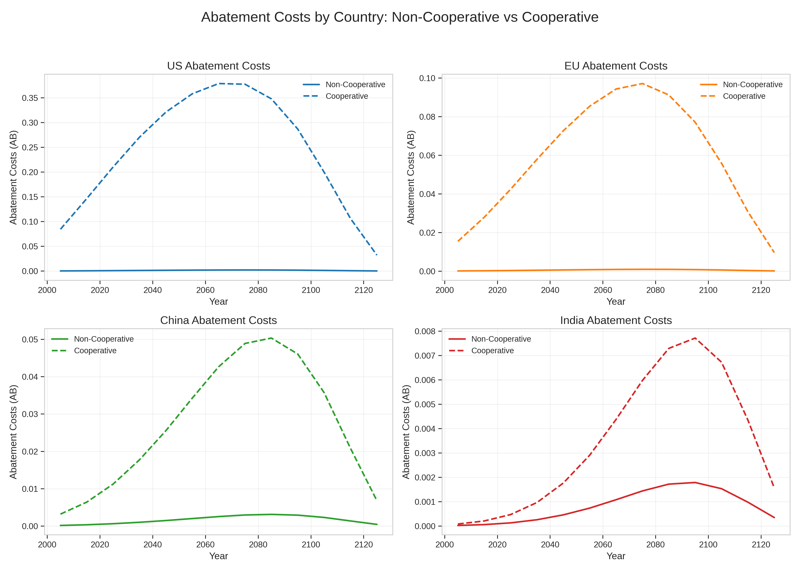
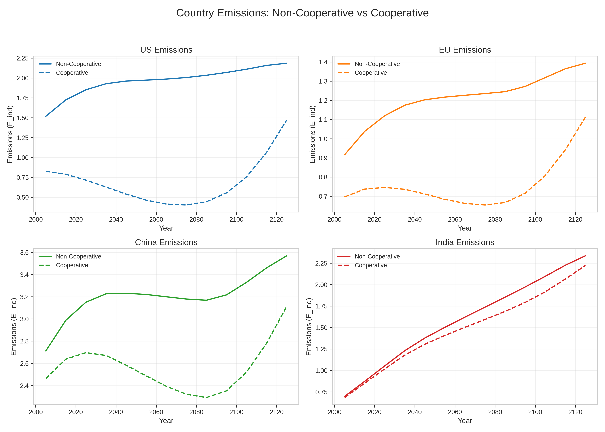
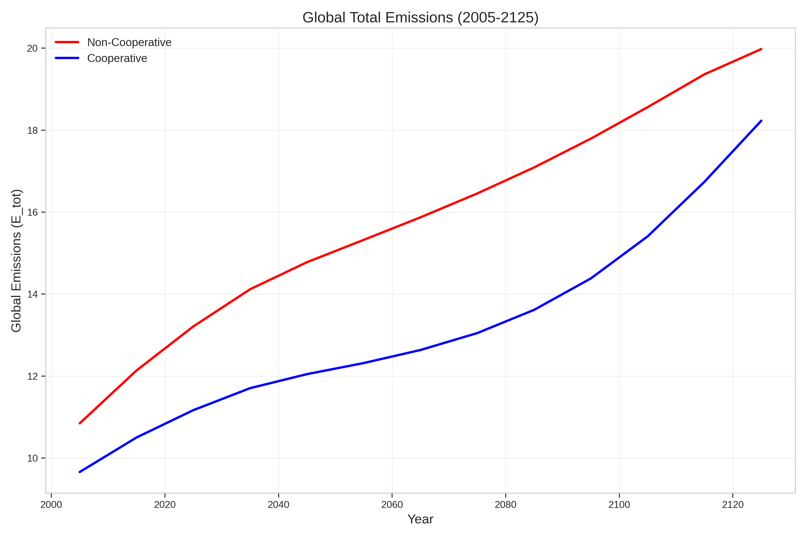
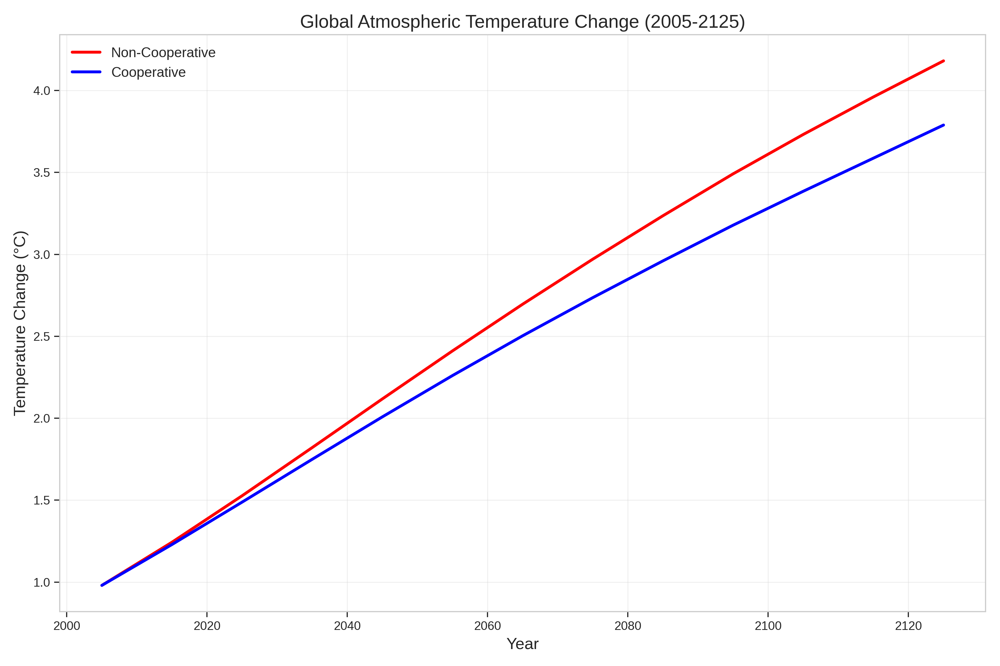

# Regional Climate Cooperation: A RICE Model Analysis

> **Model:** RICE-2013 (Nordhaus) | **Status:** Complete | **Presentation:** [imsaichauhan.github.io/rice](https://imsaichauhan.github.io/rice)

Analyze the economic and environmental impacts of climate cooperation among the United States, the European Union, China, and India from 2005 to 2125 using the Regional Integrated Climate-Economy (RICE) model.

---

## Objective

Simulate cooperative and non-cooperative (Nash equilibrium) climate policy scenarios to quantify welfare gains, emissions trajectories, and temperature outcomes from coordinated action. The central thesis is that regional cooperation yields substantial aggregate welfare benefits, but these are unevenly distributed across regions — and without appropriate policy instruments, such disparities may undermine the stability of cooperative agreements.

---

## Repository Contents

| Path | Description |
| :--- | :--- |
| `rice_presentation.qmd` | Quarto source for the revealjs presentation |
| `docs/index.html` | Rendered presentation (served via GitHub Pages) |
| `assets/` | Source figures used in the presentation and paper |
| `rice-model-climate-cooperation.pdf` | Full paper |

---

## Data Sources

| Dataset | Source | Notes |
| :--- | :--- | :--- |
| GHG Emissions by Region | [climatewatchdata.org](https://www.climatewatchdata.org/ghg-emissions) | US, EU, China, India shares of global anthropogenic emissions |
| RICE-2013 Model Parameters | [github.com/white-heomoi/RICE13_pyomo](https://github.com/white-heomoi/RICE13_pyomo) | Regional economic, damage, and abatement cost parameters; Python/Pyomo implementation |

---

## Methodology

**Model framework:** RICE-2013 (Nordhaus), implemented in Python via the `RICE13_pyomo` repository. Extends the global DICE model by disaggregating the world into four regions: US, EU, China (CHI), and India (IND). Core modules:

- Economic module: Cobb-Douglas production function per region, driven by population and total factor productivity projections.
- Emissions module: Regional emissions linked to economic output via carbon intensity parameters and mitigation rate.
- Climate module: Simplified climate box model translating emissions into atmospheric concentrations, radiative forcing, and temperature change.
- Damage function: Nonlinear reduction in regional output as a function of temperature increase; damage parameters vary by region.
- Abatement cost function: Convex function of emissions reductions, capturing increasing marginal costs of abatement.
- Utility and welfare: Discounted sum of per capita consumption utility, incorporating a pure rate of time preference and intertemporal elasticity of substitution.

**Scenario design:** Two scenarios simulated over 2005-2125 in 10-year steps.

| Scenario | Description |
| :--- | :--- |
| Non-Cooperative (Nash Equilibrium) | Each region independently maximizes own welfare; no coordination |
| Fully Cooperative (Global Optimum) | Regions jointly maximize summed discounted welfare; global emissions externality internalized |

**Optimization:** Nonlinear programming via Pyomo with the IPOPT 3.9.1 solver. The algorithm solves each region's problem sequentially, holding other regions fixed at the previous round's values, iterating until convergence in control variables is reached.

---

## Results

**Carbon pricing:** Under cooperation, US abatement costs rise from approximately 0.08% of gross output in 2005 to a peak near 0.37% around 2070. The EU follows a similar profile at lower levels. China and India show more moderate increases aligned with developmental priorities. Under non-cooperation, abatement costs are negligible throughout, indicating widespread free-riding.

**Emissions:** US industrial emissions fall by nearly 50% by 2085 relative to 2005 levels under cooperation. China and India continue growing near-term but at a substantially slower rate. Global industrial emissions reach approximately 13.61 GtCO2 by 2085 under cooperation, compared to approximately 17.09 GtCO2 under non-cooperation.

**Temperature:** Cooperation limits global warming to approximately 2.96 deg C by 2085 and 3.78 deg C by 2125. Non-cooperation results in approximately 3.23 deg C by 2085 and 4.18 deg C by 2125, a difference of approximately 0.4 deg C by 2125.

**Distribution:** Developed economies (US, EU) bear higher initial abatement costs but gain from reduced long-term damages and policy certainty. Emerging economies (China, India) moderate emissions growth without sacrificing development when supported by technology transfer and climate finance mechanisms.

---

## Policy Implications

Harmonized carbon pricing is the primary lever for closing the gap between cooperative and non-cooperative outcomes. Equitable financial and technological transfers to developing regions are necessary to sustain cooperation. Carbon Border Adjustment Mechanisms offer a route to address competitiveness concerns and incentivize broader participation, but require careful design to avoid trade disputes. Adaptive governance frameworks that account for political uncertainty are essential for durable international climate agreements.

---

## Limitations

Expand

- Damage functions are simplified; tropical and developing regions likely face substantially higher climate damages than the RICE-2013 parameterization captures (Anthoff and Tol, 2013).
- Technology is treated as static; no endogenous innovation, learning curves, or adaptive mitigation pathways.
- Political economy dynamics, negotiation frictions, and enforcement mechanisms are excluded from the model.
- Only two scenarios (full cooperation vs. full non-cooperation) are simulated; partial coalition structures and explicit side-payment schemes are not modeled.
- Four-region aggregation obscures within-region heterogeneity, particularly for large blocs such as the EU and developing Asia.
- Single model validation only; results are sensitive to RICE-2013 parameter assumptions and discount rate choices.

---

## References

- Nordhaus and Yang (1996), RICE regional dynamic general-equilibrium model: [jstor.org](https://www.jstor.org/stable/2118303)
- Nordhaus (2009), efficient approaches to control of global warming: [PDF](https://cdi.mecon.gob.ar/bases/docelec/cowles/d1716.pdf)
- Anthoff and Tol (2013), uncertainty in the social cost of carbon: [doi.org](https://doi.org/10.1007/s10584-012-0659-y)
- Barrett and Stavins (2003), participation and compliance in international climate agreements: [doi.org](https://doi.org/10.1023/B:INEA.0000005767.67689.28)
- Finus, Furini, and Rohrer (2021), efficacy of environmental agreements with adaptation: [doi.org](https://doi.org/10.1016/j.jeem.2021.102461)
- Gazzotti et al. (2021), persistent inequality in economically optimal climate policies: [doi.org](https://doi.org/10.1038/s41467-021-23613-y)
- Nordhaus (2018), Nobel prize lecture on climate change economics: [PDF](https://www.nobelprize.org/uploads/2018/10/nordhaus-lecture.pdf)
- Barrage and Nordhaus (2024), DICE-2023 model results: [doi.org](https://doi.org/10.1073/pnas.2312030121)
- Yang (2022), RICE-2020 model dimensionality and policy outcomes: [doi.org](https://doi.org/10.1007/s10614-022-10292-0)
- Center for Robust Decision Making on Climate and Energy Policy, webDICE: [rdcep.org](http://webdice.rdcep.org/)
- IPCC AR6 Synthesis Report (2023): [ipcc.ch](https://www.ipcc.ch/report/ar6/syr/)
- Shah, A. (2025), a dark moment on CO2 control, Business Standard: [mayin.org](https://www.mayin.org/ajayshah/MEDIA/2025/climate-gloom.html)
- RICE13_pyomo implementation: [github.com/white-heomoi/RICE13_pyomo](https://github.com/white-heomoi/RICE13_pyomo)
